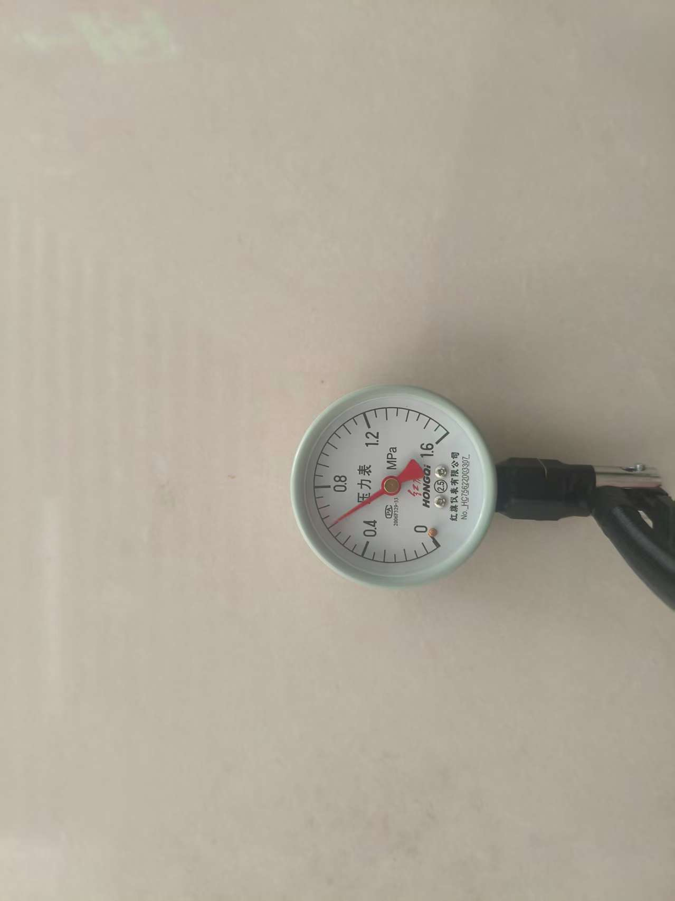
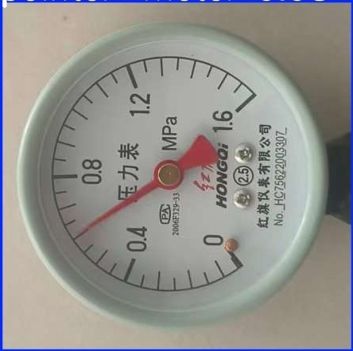
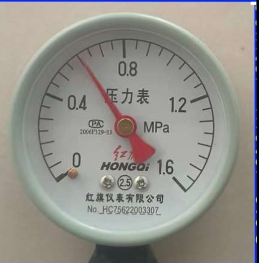
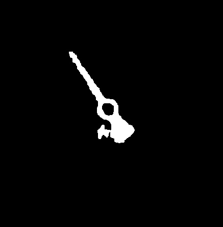
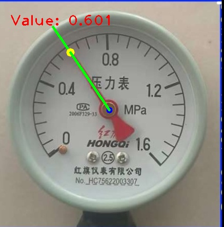

# Pointer Meter Reader / 指针式仪表读数识别

English | [中文](#中文)

> A pointer meter reading system based on **YOLO object detection** and **classical computer vision**.
> It detects the meter region with YOLO, corrects pose with ORB homography, segments the red pointer in HSV space,
> and converts the pointer angle to a reading using multi-anchor interpolation.

---

## Table of Contents

- [Pointer Meter Reader / 指针式仪表读数识别](#pointer-meter-reader--指针式仪表读数识别)
  - [Table of Contents](#table-of-contents)
  - [Overview](#overview)
  - [Project Structure](#project-structure)
  - [Results](#results)
  - [Visual Examples / 效果展示](#visual-examples--效果展示)
  - [Installation](#installation)
  - [How to Use](#how-to-use)
    - [Step 1: Calibrate](#step-1-calibrate)
    - [Step 2: YOLO detection](#step-2-yolo-detection)
    - [Step 3: Crop meter regions](#step-3-crop-meter-regions)
    - [Step 4: Read values](#step-4-read-values)
      - [Single image](#single-image)
      - [Batch processing](#batch-processing)
    - [Step 5: Compare methods](#step-5-compare-methods)
  - [Important: Hard-coded Paths](#important-hard-coded-paths)
  - [License](#license)
- [中文](#中文)
  - [快速开始](#快速开始)
  - [使用流程](#使用流程)
  - [注意：硬编码路径](#注意硬编码路径)
  - [协议](#协议)

---

## Overview

This project was originally built for a pointer-type instrument (gauge) recognition task.
The full pipeline is:

```text
Raw images
    ↓
YOLO detection (predict_1111.py)
    ↓
Detected images + labels/*.txt
    ↓
Crop single-meter images (separate_1111.py)
    ↓
Align + read (read_copy_bai_new.py / batch_read_copy_bai_copy.py)
    ↓
Aligned images, pointer mask, result image, summary.csv
    ↓
(Optional) multi-method comparison (batch_compare_readers.py)
```

The current code is an engineering implementation variant that uses:

- **YOLO** for meter detection,
- **ORB + RANSAC homography** (with Hough circle fallback) for pose correction,
- **HSV red-pointer segmentation** for pointer extraction,
- **Multi-anchor angle interpolation** for value conversion.

---

## Project Structure

```text
.
├── LICENSE                       # MIT License
├── README.md                     # This file
├── requirements.txt              # Python dependencies
├── .gitignore                    # Files ignored by Git
│
├── 用到的代码/                    # Source code
│   ├── 990.py                    # Interactive calibration tool
│   ├── predict_1111.py           # YOLO inference
│   ├── separate_1111.py          # Crop meters from YOLO outputs
│   ├── read_copy_bai_new.py      # Core reader (GaugeApp class)
│   ├── batch_read_copy_bai_copy.py   # Batch reading
│   ├── equal_angle_linear_reader.py  # Baseline: equal-angle linear mapping
│   ├── traditional_hough_reader.py   # Baseline: Hough line detection
│   ├── batch_compare_readers.py      # Compare three methods
│   └── calibration_data.txt      # Example calibration file
│
├── yolo最新权重文件/               # Pre-trained YOLO weights ✅ Included
│   └── best.pt                   # YOLOv8 model for meter detection
│
├── 1.原始数据集/                  # Raw dataset
│   ├── 分散/                     # Images grouped by challenge type
│   │   ├── 暗光/
│   │   ├── 背景干扰/
│   │   ├── 高曝光/
│   │   ├── 倾斜拍摄/
│   │   ├── 远近尺度变化/
│   │   └── 正常光照/
│   └── 汇总/                     # All images merged
│
├── 2.yolo识别之后图片/            # YOLO detection outputs (generated)
├── 3.边框截取之后/                # Cropped meter images (generated)
├── 4.摆正+识别/                   # Alignment + reading results (generated)
│
├── yolo参数/                      # YOLO training logs
│   ├── results.csv
│   └── yolo_metrics_summary.csv
│
├── 对比/                          # Method comparison results
    ├── read2/
    └── reader_comparison_results_2/

```

---

## Results

Our best method (`proposed_multi_anchor`) on the collected dataset:

| Method                | Success rate |    MAE | Accuracy within ±0.05 |
| --------------------- | -----------: | -----: | ---------------------: |
| proposed_multi_anchor |        1.000 | 0.0087 |                  1.000 |
| equal_angle_linear    |        1.000 | 0.0295 |                  0.948 |
| traditional_hough     |        0.931 | 0.1075 |                  0.889 |

YOLO detection performance (from `yolo参数/yolo_metrics_summary.csv`):

| Metric       |   Value |
| ------------ | ------: |
| Precision    | 0.99417 |
| Recall       | 1.00000 |
| mAP@0.5      | 0.99500 |
| mAP@0.5:0.95 | 0.97950 |

---

## Visual Examples / 效果展示

Here's a complete pipeline example showing how an image is processed:

| Step                                    | Image                              | Description                                     |
| --------------------------------------- | ---------------------------------- | ----------------------------------------------- |
| 1.**Original** 原始仪表           |  | Raw meter image captured from camera            |
| 2.**Cropped** 裁剪                |    | Single meter region extracted by YOLO detection |
| 3.**Aligned** 摆正                |    | Image aligned to template using ORB + RANSAC    |
| 4.**Pointer Mask** 指针提取       |  | Red pointer segmented in HSV color space        |
| 5.**Recognition Result** 识别结果 |      | Final reading displayed on aligned image        |

The complete pipeline transforms a raw meter image to a precise numerical reading with high accuracy.

---

## Installation

```bash
# 1. Clone the repository
git clone https://github.com/YOUR_USERNAME/pointer-meter-reader.git
cd pointer-meter-reader

# 2. Create a virtual environment (recommended)
python -m venv venv

# On Windows
venv\Scripts\activate

# On Linux/macOS
source venv/bin/activate

# 3. Install dependencies
pip install -r requirements.txt
```

> **Note:** Some systems may need additional OpenCV system libraries. If `cv2` fails to import, please follow the official OpenCV installation guide for your OS.

---

## How to Use

### Step 1: Calibrate

Calibration generates `calibration_data.txt`, which maps pointer angles to real values.

```bash
cd 用到的代码
python 990.py
```

What happens:

1. A window opens showing the template image.
2. Press `c` to start calibration.
3. Click the **center** of the gauge.
4. Click **32 points** along the pointer positions from the minimum value to the maximum value (e.g., 0.0 → 1.6).
5. The file `calibration_data.txt` is saved.

If you already have a calibration file, place it in the working directory before running the reader.

### Step 2: YOLO detection

Edit `用到的代码/predict_1111.py` and replace the paths for **input images and output directory**:

```python
model = YOLO("../yolo最新权重文件/best.pt")  # ✅ Pre-trained model path (no change needed)
results = model.predict(
    source="path/to/your/raw/images",       # ⚠️ Change this to your raw images folder
    imgsz=640,
    conf=0.55,
    save=True,
    save_txt=True,
    project="path/to/your/output"           # ⚠️ Change this to your output folder
)
```

Then run:

```bash
cd 用到的代码
python predict_1111.py
```

This produces:

- Detection images in `<project>/predict/`
- Label files in `<project>/predict/labels/*.txt`

### Step 3: Crop meter regions

Edit `用到的代码/separate_1111.py` and set your own paths:

```python
img_path   = 'path/to/your/predict/images'
label_path = 'path/to/your/predict/labels'
save_path  = 'path/to/your/cropped/images'
```

Then run:

```bash
cd 用到的代码
python separate_1111.py
```

### Step 4: Read values

#### Single image

Edit `用到的代码/read_copy_bai_new.py`:

```python
IMG_PATH      = r"your_template.jpg"      # Template used for calibration and alignment
TEST_IMG_PATH = r"your_test_image.jpg"    # Image to read
```

Then run:

```bash
cd 用到的代码
python read_copy_bai_new.py
```

Outputs are saved to `debug_output/`.

#### Batch processing

```bash
cd 用到的代码
python batch_read_copy_bai_copy.py path/to/cropped/images
```

Results are saved to `batch_image_results/`.

### Step 5: Compare methods

```bash
cd 用到的代码
python batch_compare_readers.py path/to/cropped/images --ground-truth path/to/summary.csv
```

This runs three readers and produces `reader_comparison_results_2/summary.csv` and `reader_comparison_results_2/metrics.csv`.

---

## Important: Hard-coded Paths

This repository still contains the original hard-coded paths from the development environment (e.g., `/home/qya/...`).
**Before running, you must change these paths to match your own machine.**

The files with hard-coded paths are:

| File                                | What to change                                           |
| ----------------------------------- | -------------------------------------------------------- |
| `用到的代码/predict_1111.py`      | Path to YOLO weights, input images, and output directory |
| `用到的代码/separate_1111.py`     | Paths to YOLO detection images, labels, and crop output  |
| `用到的代码/990.py`               | `IMG_PATH` (template image)                            |
| `用到的代码/read_copy_bai_new.py` | `IMG_PATH`, `TEST_IMG_PATH`, `DEBUG_OUTPUT_DIR`    |

`batch_read_copy_bai_copy.py` and `batch_compare_readers.py` already use `argparse` and only need a default template path if you want to change it.

---

## License

This project is released under the [MIT License](LICENSE).

---

# 中文

> 基于 **YOLO 目标检测** 与 **经典计算机视觉算法** 的指针式仪表读数识别系统。
> 流程：YOLO 检测仪表区域 → 根据检测框裁剪单表图像 → 使用 ORB 单应性矩阵摆正 → HSV 红色指针分割 → 多锚点角度插值得到读数。

## 快速开始

```bash
# 克隆仓库
git clone https://github.com/YOUR_USERNAME/pointer-meter-reader.git
cd pointer-meter-reader

# 创建虚拟环境并安装依赖
python -m venv venv
# Windows:
venv\Scripts\activate
# Linux/macOS:
source venv/bin/activate

pip install -r requirements.txt
```

## 使用流程

1. **标定**：运行 `用到的代码/990.py`，按 `c` 开始，点击表盘中心和 32 个刻度位置，生成 `calibration_data.txt`。
2. **YOLO 检测**：修改 `predict_1111.py` 中的路径，运行生成检测图和 `labels/*.txt`。
3. **裁剪**：修改 `separate_1111.py` 中的路径，裁剪出单表图像。
4. **读数**：
   - 单张：`read_copy_bai_new.py`（修改 `IMG_PATH` 和 `TEST_IMG_PATH`）
   - 批量：`batch_read_copy_bai_copy.py 裁剪图文件夹`
5. **（可选）方法对比**：`batch_compare_readers.py 裁剪图文件夹 --ground-truth summary.csv`

## 注意：硬编码路径

本仓库保留了原作者开发环境中的绝对路径（如 `/home/qya/...`）。**运行前请将这些路径修改为你自己电脑上的路径。**

需要修改路径的文件见上方 [Important: Hard-coded Paths](#important-hard-coded-paths)。

## 协议

本项目采用 [MIT License](LICENSE)。
